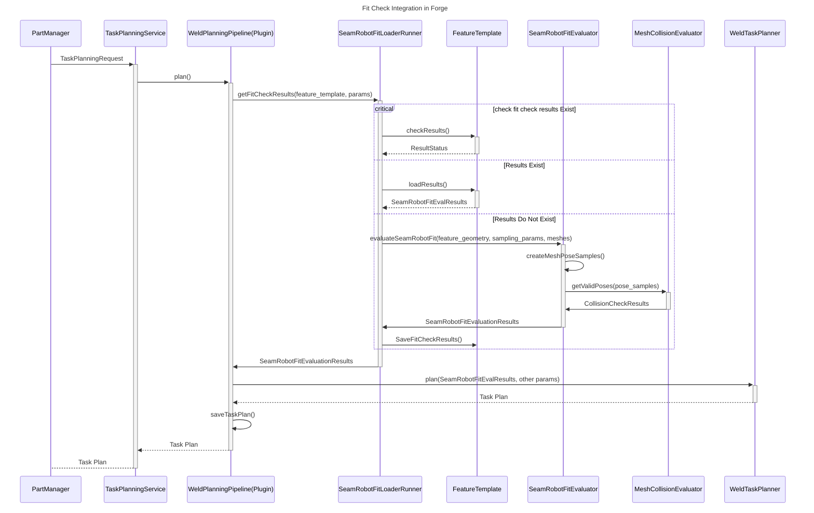

```mermaid
sequenceDiagram
    title Fit Check Integration in Forge
    PartManager->>+TaskPlanningService: TaskPlanningRequest
    TaskPlanningService->>+WeldPlanningPipeline(Plugin): plan()
    WeldPlanningPipeline(Plugin)->>+SeamRobotFitLoaderRunner: getFitCheckResults(feature_template, params)

    critical check fit check results Exist
        SeamRobotFitLoaderRunner->>+FeatureTemplate: checkResults()
        FeatureTemplate-->>-SeamRobotFitLoaderRunner: ResultStatus
        option Results Exist
        SeamRobotFitLoaderRunner->>+FeatureTemplate: loadResults()
        FeatureTemplate-->>-SeamRobotFitLoaderRunner: SeamRobotFitEvalResults
        option Results Do Not Exist
        SeamRobotFitLoaderRunner->>+SeamRobotFitEvaluator: evaluateSeamRobotFit(feature_geometry, sampling_params, meshes)
        SeamRobotFitEvaluator->>SeamRobotFitEvaluator: createMeshPoseSamples()
        SeamRobotFitEvaluator->>+MeshCollisionEvaluator: getValidPoses(pose_samples)
        MeshCollisionEvaluator->>-SeamRobotFitEvaluator: CollisionCheckResults
        SeamRobotFitEvaluator->>-SeamRobotFitLoaderRunner: SeamRobotFitEvaluationResults
        SeamRobotFitLoaderRunner->>FeatureTemplate: SaveFitCheckResults()
    end

    SeamRobotFitLoaderRunner->>-WeldPlanningPipeline(Plugin): SeamRobotFitEvaluationResults
    WeldPlanningPipeline(Plugin)->>+WeldTaskPlanner: plan(SeamRobotFitEvalResults, other params)
    WeldTaskPlanner-->>-WeldPlanningPipeline(Plugin): Task Plan
    WeldPlanningPipeline(Plugin)->>WeldPlanningPipeline(Plugin): saveTaskPlan()
    WeldPlanningPipeline(Plugin)-->>-TaskPlanningService: Task Plan
    TaskPlanningService-->-PartManager: Task Plan
```
