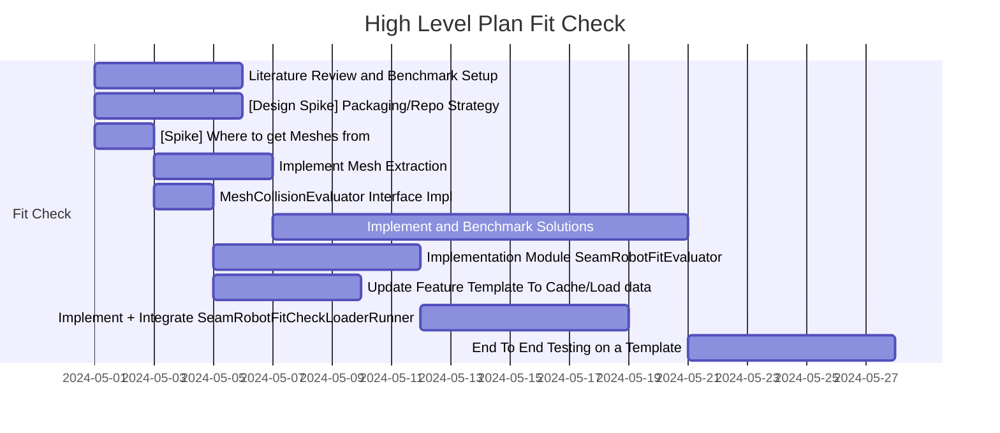

```mermaid
gantt
    title High Level Plan Fit Check
    dateFormat  YY-MM-DD
    section Fit Check
    Literature Review and Benchmark Setup                       :lit_review, 24-05-01, 5d
    [Design Spike] Packaging/Repo Strategy                      :repo_start, 24-05-01, 5d
    [Spike] Where to get Meshes from                            :mesh_spike,24-05-01, 2d
    Implement Mesh Extraction                                   :mesh_ex, after mesh_spike, 4d
    MeshCollisionEvaluator Interface Impl                       :mesh_col_eval_interface_impl, after mesh_spike  , 2d
    Implement and Benchmark Solutions                           :impl_benchmark_sol, after lit_review and mesh_ex, 14d
    Implementation Module SeamRobotFitEvaluator                 :seam_robot_fit_eval_imp, after mesh_col_eval_interface_impl, 7d
    Update Feature Template To Cache/Load data                  :update_feature_template, after mesh_col_eval_interface_impl, 5d
    Implement + Integrate SeamRobotFitCheckLoaderRunner         :impl_intg_result_loader_runner, after update_feature_template and seam_robot_fit_eval_imp, 7d
    End To End Testing on a Template                            :after impl_benchmark_sol and impl_intg_result_loader_runner, 7d
```