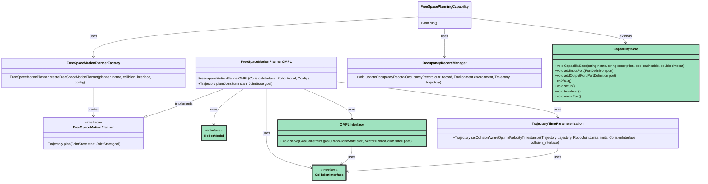

```mermaid
---
  config:
    class:
      hideEmptyMembersBox: true
---

classDiagram
    class FreeSpaceMotionPlanner {
        <<interface>>
        +Trajectory plan(JointState start, JointState goal)
    }

    class FreeSpaceMotionPlannerOMPL {

        FreesapaceMotionPlannerOMPL(CollisionInterface, RobotModel, Config)
        +Trajectory plan(JointState start, JointState goal)
    }

    class FreeSpaceMotionPlannerFactory {
        +FreeSpaceMotionPlanner createFreeSpaceMotionPlanner(planner_name, collision_interface, config)
    }

    class CollisionInterface:::implemented {
        <<interface>>
    }

    class RobotModel:::implemented {
        <<interface>>
    }

    class TrajectoryTimeParameterization {
        +Trajectory setCollisionAwareOptimalVelocityTimestamps(Trajectory trajectory, RobotJointLimits limits, CollisionInterface collision_interface)
    }

    class OccupancyRecordManager {
        +void updateOccupancyRecord(OccupancyRecord curr_record, Environment environment, Trajectory trajectory)
    }

    class FreeSpacePlanningCapability {
        +void run()
    }

    class CapabilityBase:::implemented {
        
        +void CapabilityBase(string name, string description, bool cacheable, double timeout)
        +void addInputPort(PortDefinition port)
        +void addOutputPort(PortDefinition port)
        +void run()*
        +void setup()
        +void teardown()
        +void mockRun()
        
    }

    class OMPLInterface:::implemented {
        + void solve(GoalConstraint goal, RobotJointState start, vector~RobotJointState~ path)
    }


    FreeSpaceMotionPlannerFactory --> FreeSpaceMotionPlanner : creates
    FreeSpaceMotionPlannerOMPL --|> FreeSpaceMotionPlanner : implements
    FreeSpaceMotionPlannerOMPL --> CollisionInterface : uses
    FreeSpaceMotionPlannerOMPL --> RobotModel : uses
    FreeSpaceMotionPlannerOMPL --> TrajectoryTimeParameterization : uses
    FreeSpaceMotionPlannerOMPL --> OMPLInterface : uses
    OMPLInterface --> CollisionInterface : uses
    TrajectoryTimeParameterization --> CollisionInterface : uses
    FreeSpacePlanningCapability --> CapabilityBase : extends
    FreeSpacePlanningCapability --> FreeSpaceMotionPlannerFactory : uses
    FreeSpacePlanningCapability --> OccupancyRecordManager : uses


    style CapabilityBase fill:#9FE2BF,stroke:#333,stroke-width:4px;
    style OMPLInterface fill:#9FE2BF,stroke:#333,stroke-width:4px;
    style RobotModel fill:#9FE2BF,stroke:#333,stroke-width:4px;
    style CollisionInterface fill:#9FE2BF,stroke:#333,stroke-width:4px;
```
