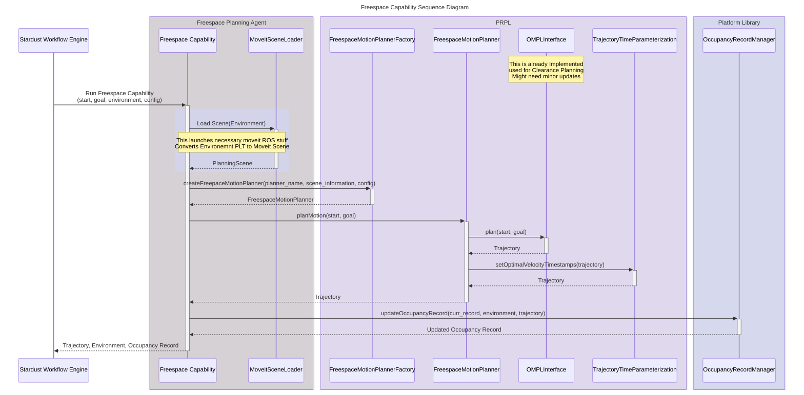

```mermaid
sequenceDiagram
    title Freespace Capability Sequence Diagram

    participant Stardust Workflow Engine

    box rgba(210,200,205,0.5) Freespace Planning Agent
    participant Freespace Capability
    participant MoveitSceneLoader
    end

    box rgba(230,215,255,0.5) PRPL
    participant FreespaceMotionPlannerFactory
    participant FreespaceMotionPlanner
    participant OMPLInterface
    participant TrajectoryTimeParameterization
    end

    box rgba(210,215,255,0.5) Platform Library
    participant OccupancyRecordManager
    end

    Note over OMPLInterface: This is already Implemented <br/> used for Clearance Planning <br/> Might need minor updates


    Stardust Workflow Engine ->>+ Freespace Capability: Run Freespace Capability<br/> (start, goal, environment, config)

    rect rgba(210,215,255,0.5) 
    Freespace Capability ->>+ MoveitSceneLoader: Load Scene(Environment)
    Note over Freespace Capability, MoveitSceneLoader: This launches necessary moveit ROS stuff<br/>Converts Environemnt PLT to Moveit Scene
    MoveitSceneLoader -->>- Freespace Capability: PlanningScene
    end
    
    Freespace Capability ->>+ FreespaceMotionPlannerFactory: createFreepaceMotionPlanner(planner_name, scene_information, config)
    FreespaceMotionPlannerFactory -->>- Freespace Capability: FreespaceMotionPlanner
    Freespace Capability ->>+ FreespaceMotionPlanner: planMotion(start, goal)
    FreespaceMotionPlanner ->>+ OMPLInterface: plan(start, goal)
   
    OMPLInterface -->>- FreespaceMotionPlanner: Trajectory
    FreespaceMotionPlanner ->>+ TrajectoryTimeParameterization: setOptimalVelocityTimestamps(trajectory)
    TrajectoryTimeParameterization -->>- FreespaceMotionPlanner: Trajectory
    FreespaceMotionPlanner -->>- Freespace Capability: Trajectory
    Freespace Capability ->>+ OccupancyRecordManager: updateOccupancyRecord(curr_record, environment, trajectory)
    OccupancyRecordManager -->>- Freespace Capability: Updated Occupancy Record
    Freespace Capability -->>- Stardust Workflow Engine: Trajectory, Environment, Occupancy Record


```