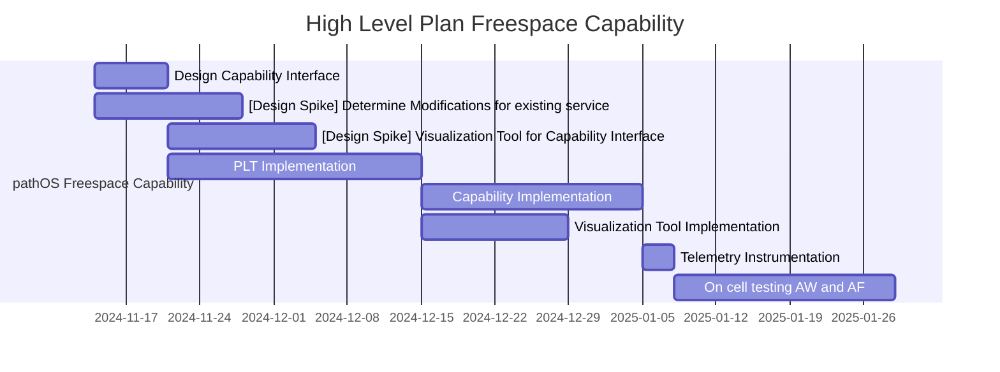

```mermaid
gantt
    title High Level Plan Freespace Capability
    dateFormat  YY-MM-DD
    section pathOS Freespace Capability
    Design Capability Interface                                                      :cap_design, 24-11-14, 7d
    [Design Spike] Determine Modifications for existing service                      :mod_design, 24-11-14, 14d
    [Design Spike] Visualization Tool for Capability Interface                       :viz_design, after cap_design, 14d
    PLT Implementation                                                               :plt_impl , after cap_design, 24d
    Capability Implementation                                                        :cap_impl, after plt_impl, 21d
    Visualization Tool Implementation                                                :viz_impl, after viz_design and after plt_impl, 14d
    Telemetry Instrumentation                                                        :tel_impl, after cap_impl  , 3d
    On cell testing AW and AF                                                        :on_cell_test, after tel_impl, 21d
```