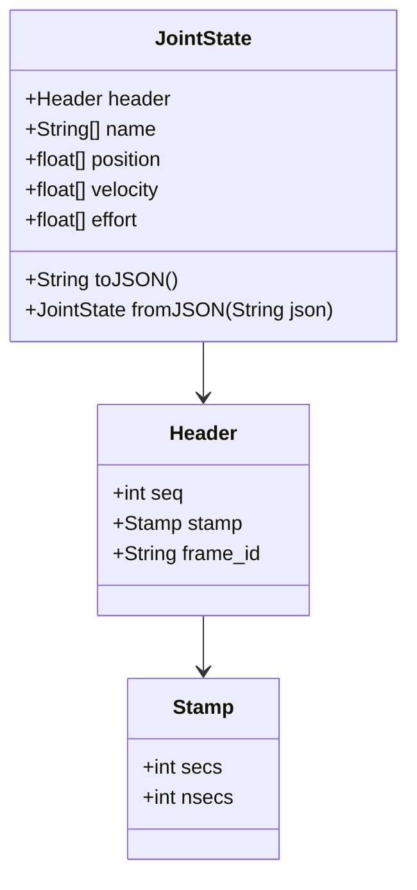

```mermaid
classDiagram
    class JointState {
        +Header header
        +String[] name
        +float[] position
        +float[] velocity
        +float[] effort
        +String toJSON()
        +JointState fromJSON(String json)
    }

    class Header {
        +int seq
        +Stamp stamp
        +String frame_id
    }

    class Stamp {
        +int secs
        +int nsecs
    }

    JointState --> Header
    Header --> Stamp
```