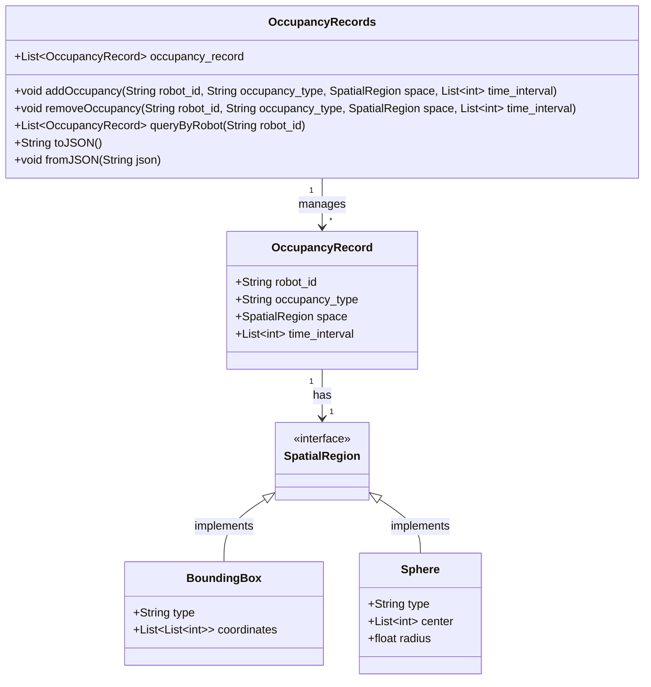

```mermaid
classDiagram
    class OccupancyRecords {
        +List~OccupancyRecord~ occupancy_record
        +void addOccupancy(String robot_id, String occupancy_type, SpatialRegion space, List~int~ time_interval)
        +void removeOccupancy(String robot_id, String occupancy_type, SpatialRegion space, List~int~ time_interval)
        +List~OccupancyRecord~ queryByRobot(String robot_id)
        +String toJSON()
        +void fromJSON(String json)
    }

    class OccupancyRecord {
        +String robot_id
        +String occupancy_type
        +SpatialRegion space
        +List~int~ time_interval
    }

    class SpatialRegion {
        <<interface>>
    }

    class BoundingBox {
        +String type
        +List~List~int~~ coordinates
    }

    class Sphere {
        +String type
        +List~int~ center
        +float radius
    }

    OccupancyRecords "1" --> "*" OccupancyRecord : manages
    OccupancyRecord "1" --> "1" SpatialRegion : has
    SpatialRegion <|-- BoundingBox : implements
    SpatialRegion <|-- Sphere : implements

```
